# Retrieval-Augmented Generation: Technical Architecture, Optimization, and Evaluation of Production RAG Systems

Draft date: May 27, 2026

## Abstract

Retrieval-Augmented Generation (RAG) is no longer just a pattern where an application searches a vector database and pastes the top chunks into a prompt. In serious production systems, RAG has become a distributed architecture that combines information retrieval, data engineering, policy enforcement, ranking, prompt orchestration, model inference, evaluation, observability, and security controls.

The central idea is simple: a language model should answer from external, updateable, inspectable knowledge instead of relying only on parametric memory stored in its weights. The engineering reality is less simple. A production RAG system must decide what documents are trustworthy, how to parse them, how to split them, how to index them, how to retrieve and rerank evidence, how to assemble context without drowning the model, how to cite sources, when to abstain, how to measure hallucination, and how to prevent unauthorized or malicious content from reaching the model.

This paper gives a system-design view of modern RAG. It covers the evolution from retrieve-then-read systems to modular, graph, multimodal, corrective, and agentic RAG; reference architectures; chunking methods; index design; hybrid retrieval; reranking; query transformation; hallucination mitigation; evaluation; observability; security; use cases; and production best practices.

## Executive Thesis

RAG should be designed as an evidence supply chain.

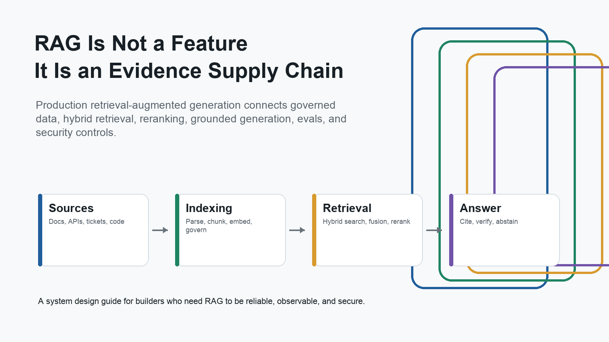

The offline side turns messy source material into governed, queryable evidence. The online side turns a user request into ranked, policy-compliant, source-labeled context. The generation side turns that evidence into an answer, while the evaluation side continuously checks whether the system retrieved the right evidence and used it faithfully.

The practical implications are:

| Claim | Architectural consequence |
|---|---|
| Retrieval quality is mostly determined before retrieval. | Parsing, chunking, metadata, ACLs, freshness, and index design matter as much as model choice. |
| Vector search alone is rarely enough. | Most enterprise systems need hybrid lexical plus dense retrieval, fusion, reranking, and metadata filtering. |
| More context is not automatically better. | Context should be ranked, compressed, source-labeled, and ordered to avoid distractors and "lost in the middle" failures. |
| RAG reduces hallucination risk but does not eliminate it. | Systems need faithfulness metrics, citation checks, abstention behavior, and post-generation verification. |
| Production RAG is a policy system. | Identity, tenant isolation, document-level authorization, PII controls, audit logs, and prompt-injection defenses belong in the core architecture. |
| Optimization without evals is guesswork. | Every chunking, embedding, retrieval, reranking, prompt, and model change should be measured against offline and online evals. |

## 1. What RAG Is

The canonical RAG paper, "Retrieval-Augmented Generation for Knowledge-Intensive NLP Tasks," described a model that combines parametric memory in a seq2seq model with non-parametric memory in a dense vector index. It introduced RAG-Sequence and RAG-Token variants, depending on whether retrieved passages remain fixed for the output sequence or can vary across generated tokens ([Lewis et al., 2020](https://arxiv.org/abs/2005.11401)).

At an application architecture level, RAG typically has two major planes:

1. **Indexing/data plane:** collect documents, parse them, split them into retrievable units, enrich them with metadata, embed them, and store them in one or more indexes.
2. **Inference/control plane:** receive a user query, enforce policy, transform or route the query, retrieve evidence, rerank/compress it, assemble a grounded prompt, generate an answer, cite sources, check quality, and log the trace.

LangChain describes the same split as indexing versus retrieval-and-generation, while Microsoft's advanced RAG guidance frames the architecture around ingestion, inference, and evaluation phases ([LangChain RAG docs](https://docs.langchain.com/oss/python/langchain/rag), [Microsoft Advanced RAG](https://learn.microsoft.com/en-us/azure/developer/ai/advanced-retrieval-augmented-generation)).

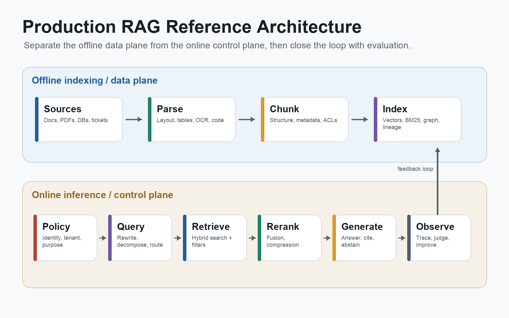

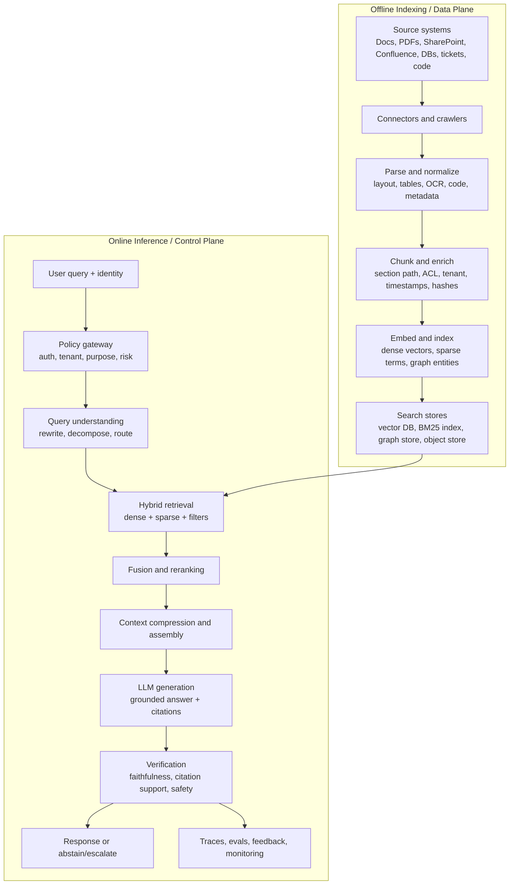

The diagram is intentionally more complex than "vector database -> prompt -> LLM." That simple view is useful for demos, but it hides most of the work needed to make RAG reliable.

## 2. Evolution of RAG Architectures

RAG evolved from open-domain question-answering systems into a broader architecture family.

| Period | Milestone | Architectural shift | Sources |
|---|---|---|---|
| 2017 | DrQA retrieves Wikipedia documents and applies a neural reader. | Retrieve-then-read open-domain QA. | [DrQA](https://arxiv.org/abs/1704.00051) |
| 2020 | DPR and REALM popularize dense retrieval for QA and pretraining. | Learned dense retrievers become competitive with sparse search for open QA. | [DPR](https://arxiv.org/abs/2004.04906), [REALM](https://www.microsoft.com/en-us/research/publication/realm-retrieval-augmented-language-model-pre-training/) |
| 2020 | Lewis et al. introduce RAG for knowledge-intensive NLP. | Generator uses retrieved non-parametric memory. | [RAG](https://arxiv.org/abs/2005.11401) |
| 2021-2022 | RETRO and Atlas show retrieval as a scaling and few-shot learning strategy. | Retrieval becomes part of model capability, not just app plumbing. | [RETRO](https://proceedings.mlr.press/v162/borgeaud22a.html), [Atlas](https://arxiv.org/abs/2208.03299) |
| 2022 | MuRAG extends retrieval-augmented generation to image-text memory. | Multimodal evidence enters the retrieval layer. | [MuRAG](https://arxiv.org/abs/2210.02928) |
| 2023-2024 | RAG surveys formalize naive, advanced, and modular RAG. | Retrieval, augmentation, generation, routing, and verification become separable modules. | [RAG survey](https://arxiv.org/abs/2312.10997), [Modular RAG](https://arxiv.org/abs/2407.21059) |
| 2023-2024 | Self-RAG, CRAG, Adaptive-RAG, and FLARE add reflection and control. | Systems decide when to retrieve, whether evidence is good, and when to correct retrieval. | [Self-RAG](https://arxiv.org/abs/2310.11511), [CRAG](https://arxiv.org/abs/2401.15884), [Adaptive-RAG](https://arxiv.org/abs/2403.14403), [FLARE](https://arxiv.org/abs/2305.06983) |
| 2024-2025 | GraphRAG and LightRAG popularize graph-structured retrieval. | Entity/relation/community indexes improve global and multi-hop corpus questions. | [Microsoft GraphRAG](https://arxiv.org/abs/2404.16130), [GraphRAG docs](https://microsoft.github.io/graphrag/), [LightRAG](https://arxiv.org/abs/2410.05779) |
| 2024-2025 | ColPali and visual document retrieval embed pages directly. | RAG expands beyond extracted text into layout-aware page-image retrieval. | [ColPali](https://arxiv.org/abs/2407.01449) |
| 2025-2026 | Agentic RAG surveys describe retrieval as a tool inside planning, reflection, and multi-agent workflows. | RAG becomes a controllable subsystem in agent architectures. | [Agentic RAG survey](https://arxiv.org/abs/2501.09136) |

The evolution is not a replacement story. Simple RAG remains the right baseline for many tasks. Advanced RAG adds control points when the baseline fails. Modular, graph, multimodal, and agentic RAG are specialized expansions for harder corpus, query, or workflow shapes.

## 3. Architecture Taxonomy

### 3.1 Naive RAG

Naive RAG is the standard baseline:

1. Chunk source documents.
2. Embed chunks.
3. Retrieve top-k chunks by vector similarity.
4. Add them to the prompt.
5. Generate an answer.

This design is easy to build and can work well for small, clean corpora. It fails when the corpus has poor parsing, ambiguous terms, exact identifiers, multi-hop questions, stale documents, restricted documents, tables, visual layout, or conflicting evidence.

### 3.2 Advanced RAG

Advanced RAG adds pre-retrieval and post-retrieval stages:

| Stage | Examples | Why it exists |
|---|---|---|
| Query preprocessing | rewrite, normalize, classify intent, detect language | User queries are often conversational, underspecified, or mismatched to corpus vocabulary. |
| Query decomposition | split into subquestions | Complex questions may need evidence from multiple documents or systems. |
| Routing | choose document index, SQL tool, graph store, web, or code search | One retriever rarely fits every question. |
| Hybrid retrieval | BM25 plus dense vector search | Exact terms and semantic paraphrases require different signals. |
| Rank fusion | reciprocal rank fusion, weighted fusion | Search engines and vector stores return scores on different scales. |
| Reranking | cross-encoder, ColBERT, LLM reranker | Initial retrieval optimizes recall; final context needs precision. |
| Compression | extract relevant spans, remove duplicates | Context windows are large but still not a substitute for evidence selection. |
| Verification | groundedness, citation support, policy checks | Generation can still fabricate, miscite, or violate policy. |

Microsoft's advanced RAG guidance explicitly includes query rewriting, subqueries, routers, filtering, reranking, prompt compression, fact checks, and policy checks as inference-pipeline stages ([Microsoft Advanced RAG](https://learn.microsoft.com/en-us/azure/developer/ai/advanced-retrieval-augmented-generation)).

### 3.3 Modular RAG

Modular RAG treats the system as a graph of operators rather than a single chain. Operators include:

- search
- read
- route
- rewrite
- fuse
- rerank
- compress
- verify
- reflect
- generate
- call tool
- update memory

The 2024 Modular RAG paper argues that many modern RAG systems no longer fit a linear retrieve-then-generate template and instead need routing, scheduling, fusion, branching, and looping patterns ([Modular RAG](https://arxiv.org/abs/2407.21059)).

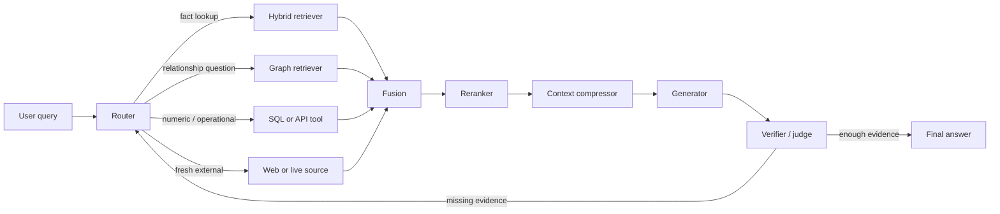

### 3.4 Graph RAG

Vector top-k retrieval works best when a small set of chunks directly answers a question. It struggles when the answer depends on distributed patterns, relationships, or corpus-level themes.

Graph RAG builds a knowledge graph over the corpus: entities, relationships, claims, communities, and summaries. Microsoft GraphRAG extracts graph structure from text, clusters communities, generates community reports, and supports global and local query modes ([Microsoft GraphRAG paper](https://arxiv.org/abs/2404.16130), [GraphRAG docs](https://microsoft.github.io/graphrag/)).

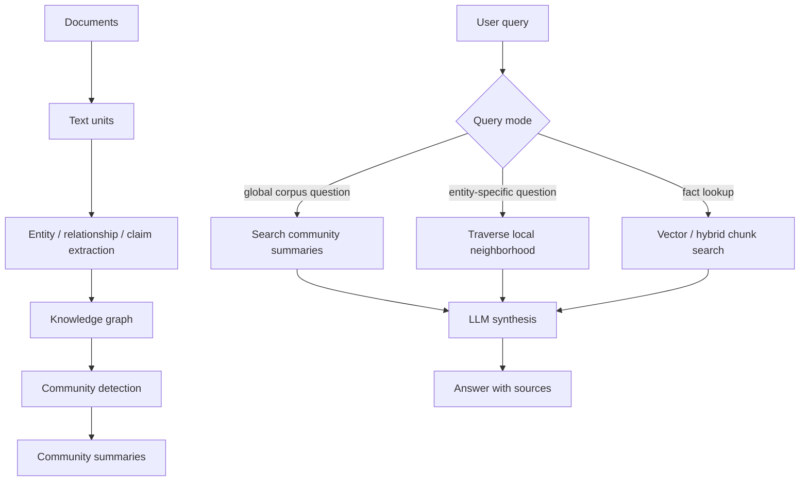

Graph RAG is not free. It adds extraction cost, graph maintenance, entity resolution, and graph-specific eval needs. It earns its keep when the product needs cross-document synthesis, multi-hop relationships, organizational intelligence, legal/compliance networks, research maps, or thematic summarization.

### 3.5 Multimodal RAG

Many important documents are not just text. Slide decks, PDFs, scans, dashboards, contracts, scientific papers, financial reports, and medical forms encode meaning in layout, tables, figures, columns, captions, typography, and page structure.

Multimodal RAG indexes text, tables, images, page screenshots, and sometimes audio or video. MuRAG introduced retrieval over multimodal memory for image-text QA ([MuRAG](https://arxiv.org/abs/2210.02928)). ColPali and related visual document retrieval work embed document page images directly with vision-language models, which can preserve visual signals that text extraction loses ([ColPali](https://arxiv.org/abs/2407.01449)).

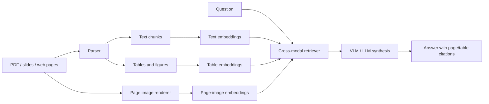

### 3.6 Agentic RAG

Agentic RAG exposes retrieval as one or more tools. The model or agent policy can decide:

- whether retrieval is needed
- which retriever to use
- how many searches to perform
- whether to inspect more evidence
- whether to call an API or database
- whether to stop and answer

LangChain's RAG-agent examples show retrieval being used as a tool inside a loop rather than as a fixed pre-generation step ([LangChain RAG docs](https://docs.langchain.com/oss/python/langchain/rag)). The Agentic RAG survey frames this as adding planning, reflection, tool use, and multi-agent collaboration to overcome static RAG workflows ([Agentic RAG survey](https://arxiv.org/abs/2501.09136)).

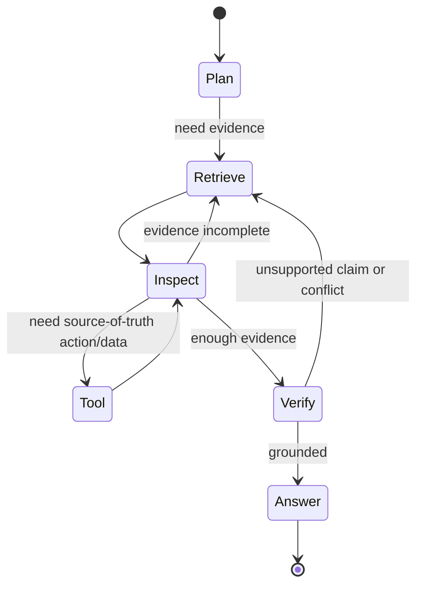

Agentic RAG is powerful for multi-step research and operational workflows, but it is harder to test, cache, budget, and secure. Production deployments should bound tool permissions, retrieval depth, loop count, token cost, and action rights.

## 4. Reference System Design

A production RAG system can be decomposed into eight subsystems.

| Subsystem | Responsibilities | Key design questions |
|---|---|---|
| Source connectors | Pull documents and metadata from source systems. | What is authoritative? How often does it change? How are deletes and permissions represented? |
| Parsing and normalization | Convert source formats into canonical text, layout, tables, images, and metadata. | Can the parser preserve tables, columns, page numbers, code blocks, headings, and captions? |
| Chunking and enrichment | Split documents into retrieval units and attach lineage. | What is the right granularity? How are parent sections, ACLs, versions, and offsets stored? |
| Embedding and indexing | Build dense, sparse, graph, and object indexes. | Which embedding model? Which distance metric? Which ANN index? What hybrid strategy? |
| Retrieval and ranking | Retrieve broad candidates, fuse, rerank, and compress. | How much recall is enough? Which reranker fits latency and cost? |
| Generation orchestration | Assemble prompt, cite sources, answer, abstain, or escalate. | How are citations enforced? What happens with weak or conflicting evidence? |
| Evaluation and observability | Measure retrieval, answer quality, faithfulness, latency, cost, and user feedback. | What gates block releases? What production traces are sampled for eval? |
| Governance and security | Enforce identity, tenant isolation, ACLs, privacy, prompt-injection defenses, and audit. | Can unauthorized chunks ever reach the prompt? Are retrieved docs treated as untrusted input? |

The online serving path is best treated as a sequence of explicit control points rather than one application function.

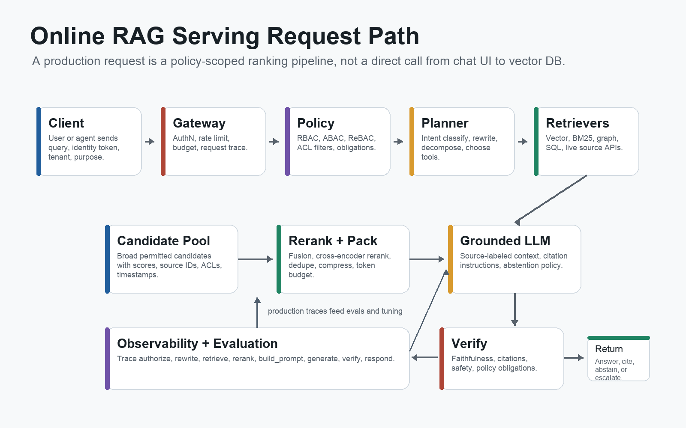

### 4.1 Enterprise ACL-Preserving RAG

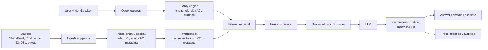

The critical rule is that authorization must happen before and during retrieval. The system should not retrieve unauthorized chunks and then ask the LLM to ignore them. Azure AI Search explicitly supports document-level access control for RAG and agentic systems ([Azure document-level ACLs](https://learn.microsoft.com/en-us/azure/search/search-document-level-access-overview)).

Enterprise RAG needs an authorization plane, not just an auth check at the application edge. A secure request resolves the user or agent identity into tenant, groups, roles, entitlements, document ACLs, sensitivity clearance, and purpose of use before any retrieval call is made.

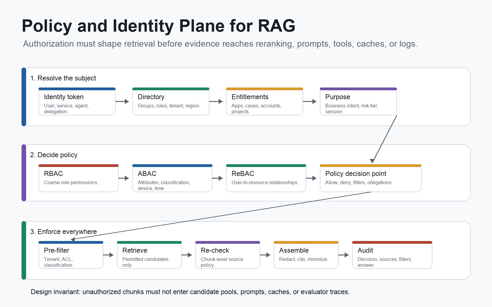

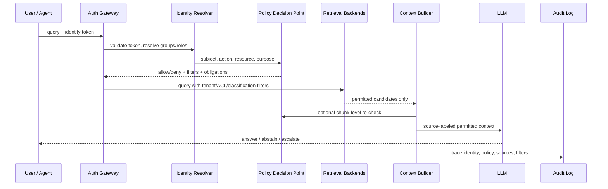

RBAC should be used for coarse organizational permissions, but RAG usually also needs ABAC and ReBAC. RBAC answers "what role does this subject have?" ABAC answers "what attributes, conditions, classifications, and purposes apply?" ReBAC answers "what relationship does this subject have to this document, account, case, project, patient, repository, or ticket?" NIST's RBAC work is the canonical access-control foundation, Google's Zanzibar paper is the classic reference for large-scale relationship authorization, and OPA is a common policy-as-code engine for structured decisions ([NIST RBAC](https://csrc.nist.gov/Projects/role-based-access-control/faqs), [Google Zanzibar](https://research.google/pubs/zanzibar-googles-consistent-global-authorization-system/), [Open Policy Agent](https://www.openpolicyagent.org/docs/latest)).

The policy decision should return a policy envelope that is enforced by every retrieval backend:

```json
{
  "allow": true,
  "filters": {
    "tenant": "acme",
    "allowed_groups": ["finance"],
    "classification": ["public", "internal", "confidential"]
  },
  "obligations": ["redact_pii", "log_sources", "cite_every_claim"]
}
```

The safest pattern is pre-filter, retrieve, rerank, re-check, assemble, answer, and audit. Post-filtering after retrieval is weaker because unauthorized chunks may already have influenced reranking, compression, or prompt assembly.

### 4.2 Multi-Tenant SaaS RAG

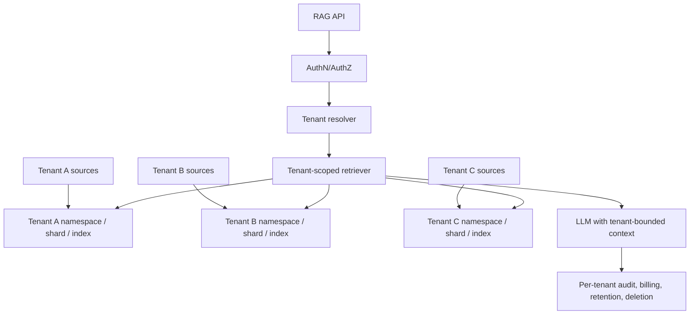

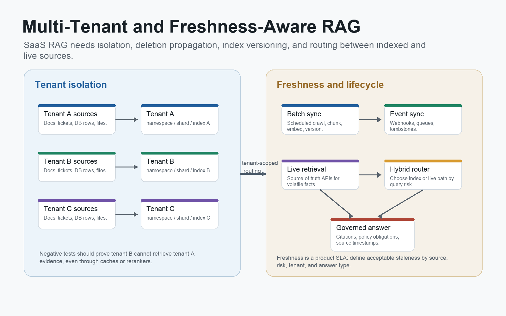

Pinecone recommends namespaces as a multi-tenancy isolation mechanism, and Weaviate supports tenant-specific shards where one tenant's data is not visible to another tenant ([Pinecone multitenancy](https://docs.pinecone.io/guides/index-data/implement-multitenancy), [Weaviate multitenancy](https://docs.weaviate.io/weaviate/manage-collections/multi-tenancy)).

### 4.3 Freshness-Oriented RAG

| Pattern | Use when | Mechanics | Tradeoff |
|---|---|---|---|
| Batch indexed RAG | Documents change hourly, daily, or weekly. | Scheduled crawlers, incremental sync, embedding rebuilds, index versioning. | Low online latency, possible staleness. |
| Event-driven RAG | Source systems emit updates. | Webhooks, change streams, queue-based embedding jobs, tombstones. | Better freshness, more operational complexity. |
| Live retrieval | Data is highly volatile or legally must come from source-of-truth. | Query source systems at runtime, retrieve only permitted snippets, log tool calls. | Freshest data, variable latency and availability. |
| Hybrid freshness | Most enterprise systems. | Index stable docs; live-query operational systems such as CRM, order status, ticket state, or EHR. | Balanced but requires routing and source policy. |

AWS frames RAG architecture choices across managed and custom approaches, while Azure's advanced RAG guidance treats update strategy as a tradeoff among corpus size, update frequency, real-time needs, and resources ([AWS RAG options](https://docs.aws.amazon.com/prescriptive-guidance/latest/retrieval-augmented-generation-options/introduction.html), [Microsoft Advanced RAG](https://learn.microsoft.com/en-us/azure/developer/ai/advanced-retrieval-augmented-generation)).

## 5. Document Ingestion, Parsing, and Chunking

RAG quality is often won or lost in ingestion. The model cannot ground an answer in evidence that parsing destroyed, chunking separated, metadata mislabeled, or indexing failed to refresh.

### 5.1 Ingestion Pipeline

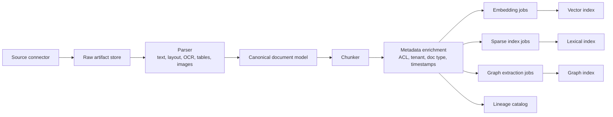

The canonical document model should preserve:

- document ID
- source URI
- source system
- source hash
- page numbers
- section hierarchy
- line or character offsets
- table boundaries
- figure captions
- code block boundaries
- author and timestamps
- document version
- tenant and ACL labels
- sensitivity classification
- parser version
- chunker version
- embedding model and dimension

### 5.2 Chunking Methodologies

| Method | How it works | Strengths | Failure modes | Best fit |
|---|---|---|---|---|
| Fixed-size/token chunking | Split every N tokens or characters. | Simple, cheap, deterministic. | Cuts across semantic boundaries, tables, definitions, and exceptions. | Logs, homogeneous plain text, quick baselines. |
| Recursive chunking | Split by natural separators such as headings, paragraphs, lines, sentences, then tokens. | Strong default for general text; better boundaries than fixed chunks. | Still blind to layout and meaning. | General documents and early production baselines. |
| Sliding window/overlap | Adjacent chunks share tokens. | Reduces boundary misses. | More vectors, duplicates, higher retrieval noise and cost. | Dense prose where answers span boundaries. |
| Structure-aware chunking | Use Markdown, HTML, PDF, code, table, and heading structure. | Preserves document semantics and citation paths. | Parser quality dominates. | Technical docs, policies, code, contracts, scientific papers. |
| Semantic chunking | Group sentences or paragraphs by embedding similarity and topical breakpoints. | Better topical coherence. | More expensive; dependent on embedding model and thresholds. | Long prose and mixed-topic documents. |
| Parent-child chunking | Embed small child chunks but return larger parent sections. | Combines recall from small chunks with context from larger sections. | More complex lineage, storage, deduping, and context budgeting. | Policies, manuals, legal docs, long technical sections. |
| Proposition/fact-level chunking | Extract atomic claims or facts as retrieval units. | High precision for factoid QA and compliance checks. | Extraction cost; facts may lose narrative or qualification. | Entity, policy, and compliance QA. |
| Late chunking | Embed a long document first, then pool token embeddings into chunk vectors. | Preserves broader context in chunk embeddings. | Requires long-context embedding/token-level access. | Long documents where local chunks need global context. |
| Query-aware/adaptive chunking | Select chunking or expansion based on query and document type. | Can improve mixed workloads. | Harder to evaluate and operate. | Heterogeneous corpora with diverse query classes. |

LangChain documents recursive splitting as a common general-purpose splitter, LlamaIndex provides semantic splitting, AWS Bedrock Knowledge Bases supports hierarchical chunking, Dense X explores proposition-level retrieval, and late chunking has been proposed for long-context embedding models ([LangChain recursive splitter](https://docs.langchain.com/oss/python/integrations/splitters/recursive_text_splitter), [LlamaIndex semantic splitter](https://developers.llamaindex.ai/python/framework-api-reference/node_parsers/semantic_splitter/), [AWS Bedrock chunking](https://docs.aws.amazon.com/bedrock/latest/userguide/kb-chunking.html), [Dense X Retrieval](https://arxiv.org/abs/2312.06648), [Late Chunking](https://arxiv.org/abs/2409.04701)).

### 5.3 Chunk Size Tradeoff

| Chunk size | Retrieval behavior | Generation behavior | Typical risk |
|---|---|---|---|
| Very small | High lexical precision, many candidates. | Missing surrounding context. | The answer sentence appears without the definition, exception, or unit. |
| Medium | Balanced recall and context. | Usually easiest to rerank and cite. | May still split tables or multi-part arguments. |
| Large | Better local context and fewer fragments. | More prompt tokens and distractors. | Reranker sees broad, noisy chunks; citations become vague. |
| Parent-child | Small chunks retrieve; parent sections answer. | Good context with high recall. | Duplicate or oversized parent context if not compressed. |

There is no universal chunk size. The right unit is the smallest source span that can stand alone as evidence for expected questions, plus enough metadata to recover parent context when needed.

### 5.4 Recommended Chunk Metadata

| Field | Purpose |
|---|---|
| `doc_id`, `chunk_id`, `parent_id` | Stable lineage, update, and citation. |
| `source_uri`, `source_system` | Traceability to original source. |
| `page`, `section_path`, `offset_start`, `offset_end` | Precise citation and debugging. |
| `content_hash`, `source_hash` | Idempotent refresh and deduplication. |
| `parser_version`, `chunker_version` | Reproducibility and migration. |
| `embedding_model`, `embedding_dim`, `embedded_at` | Vector-space safety and reindex planning. |
| `tenant_id`, `acl_principals`, `sensitivity` | Security trimming and governance. |
| `doc_type`, `language`, `jurisdiction`, `product`, `entities` | Filtering, boosting, and routing. |
| `valid_from`, `valid_to`, `last_modified` | Freshness and version-aware retrieval. |

Pinecone's data model uses records with IDs, dense/sparse vectors, and optional metadata for filtering and search; the same concept generalizes across vector stores and search engines ([Pinecone data modeling](https://docs.pinecone.io/guides/index-data/data-modeling)).

## 6. Index and Storage Design

Production RAG systems usually need more than one index.

| Store/index | Stores | Optimized for | Notes |
|---|---|---|---|
| Vector index | Dense embeddings for chunks, pages, tables, images, entities. | Semantic similarity. | Use HNSW, IVF, flat, DiskANN, or managed vector search depending on scale. |
| Sparse/lexical index | Terms, fields, BM25 statistics, analyzers. | Exact terms, IDs, names, codes, phrases. | Essential for enterprise corpora with identifiers and jargon. |
| Metadata store | Chunk records, source lineage, ACLs, versions. | Filtering, governance, debugging. | Often relational or document-oriented. |
| Object store | Raw docs, parsed artifacts, page images. | Reprocessing and audit. | Needed for parser upgrades and citation fidelity. |
| Graph store | Entities, relationships, claims, communities. | Multi-hop and corpus-level reasoning. | Useful for GraphRAG patterns. |
| Cache | Embeddings, query rewrites, retrieval results, rerank scores, answers. | Latency and cost reduction. | Cache keys must include corpus version and permissions. |

### 6.1 Dense, Sparse, and Hybrid Retrieval

Dense retrieval maps query and documents into embedding space. It handles semantic similarity and paraphrase well. Sparse retrieval such as BM25 handles exact tokens, rare identifiers, legal clauses, error codes, product names, and acronyms.

Hybrid retrieval combines both. Azure AI Search runs keyword and vector queries in parallel and merges results with Reciprocal Rank Fusion. Qdrant and Pinecone both support hybrid dense/sparse patterns ([Azure hybrid search](https://learn.microsoft.com/en-us/azure/search/hybrid-search-how-to-query), [Azure hybrid ranking](https://learn.microsoft.com/en-us/azure/search/hybrid-search-ranking), [Qdrant hybrid queries](https://qdrant.tech/documentation/search/hybrid-queries/), [Pinecone relevance guide](https://docs.pinecone.io/guides/optimize/increase-relevance)).

### 6.2 ANN and HNSW

Approximate nearest-neighbor search trades exactness for speed. HNSW builds a multi-layer navigable small-world graph for vector search, with sparse upper layers for navigation and denser lower layers for local neighborhoods ([HNSW paper](https://arxiv.org/abs/1603.09320)).

Important knobs:

| Knob | Effect |
|---|---|
| `M` | Graph degree. Higher values usually improve recall but increase memory. |
| `ef_construct` | Build-time search breadth. Higher values improve index quality but increase build time. |
| `ef_search` or `ef` | Query-time breadth. Higher values improve recall but increase latency. |
| distance metric | cosine, dot product, L2, etc. Must match embedding model assumptions. |

When recall is low, teams often blame embeddings first. They should also inspect chunking, metadata filters, candidate depth, ANN parameters, and reranker behavior.

### 6.3 Vector Backend Comparison

| Backend pattern | Strengths | Tradeoffs | Best fit |
|---|---|---|---|
| Managed vector DB | Fast setup, managed scaling, metadata filters, hybrid options. | Vendor abstraction and cost. | Teams prioritizing speed and operational simplicity. |
| Search engine with vectors | Strong BM25, filtering, facets, ACL integration, hybrid retrieval. | Vector features may be less specialized than vector-native systems. | Enterprise search and governed RAG. |
| Postgres plus pgvector | SQL, transactions, joins, full-text search, simple ops for existing Postgres teams. | ANN/filter tuning and scale limits. | Moderate corpora and product-integrated RAG. |
| Milvus/Zilliz-style vector platform | Large-scale ANN, many index types, quantization. | More operational complexity. | Very large vector workloads. |
| Graph plus vector | Relationship traversal plus semantic retrieval. | Extraction, entity resolution, graph maintenance. | Multi-hop, relationship-heavy, and corpus-level questions. |

Relevant implementation docs include pgvector, Milvus, Qdrant, Weaviate, Pinecone, and Azure AI Search ([pgvector](https://github.com/pgvector/pgvector), [Milvus](https://milvus.io/docs/overview.md), [Qdrant](https://qdrant.tech/documentation/search/), [Weaviate vector indexes](https://docs.weaviate.io/weaviate/concepts/vector-index), [Pinecone data modeling](https://docs.pinecone.io/guides/index-data/data-modeling), [Azure hybrid search](https://learn.microsoft.com/en-us/azure/search/hybrid-search-how-to-query)).

## 7. Retrieval, Fusion, Reranking, and Context Assembly

A strong RAG retrieval layer is a multi-stage ranking system.

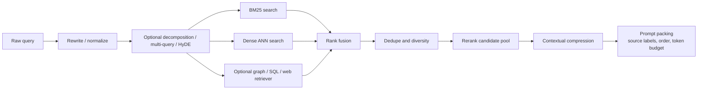

### 7.1 Retrieval Strategy Comparison

| Strategy | Core signal | Best for | Failure modes | Main knobs |
|---|---|---|---|---|
| BM25/sparse lexical | Term frequency, inverse document frequency, field boosts. | IDs, product names, legal clauses, APIs, errors. | Misses paraphrase and semantic matches. | analyzers, boosts, `k1`, `b`, fields. |
| Dense vector retrieval | Embedding similarity. | Semantic intent, broad concepts, paraphrases. | Misses exact terms, numbers, and rare entities. | embedding model, metric, chunking, top-k, ANN recall. |
| HNSW ANN | Approximate graph traversal over vectors. | Low-latency vector search at scale. | Recall loss under tight latency or filters. | `M`, `ef_construct`, `ef_search`. |
| Hybrid dense+sparse | Lexical plus semantic signals. | Real-world enterprise corpora. | Fusion and calibration complexity. | candidate depth, weights, RRF, filters. |
| Late interaction / ColBERT | Token-level query-document similarity. | High-recall passage retrieval and reranking. | Larger indexes and more complex serving. | token vectors, compression, MaxSim, candidate depth. |
| Routed retrieval | Select retriever by query type. | Multi-domain systems with docs, SQL, web, code, graph. | Router errors and extra calls. | router confidence, fallback, metadata, tool policy. |

### 7.2 Core Retrieval Algorithms

BM25 remains important because it gives strong lexical matching and works well for exact terms. Lucene's BM25 implementation documents default parameters such as `k1 = 1.2` and `b = 0.75` ([Lucene BM25Similarity](https://lucene.apache.org/core/10_1_0/core/org/apache/lucene/search/similarities/BM25Similarity.html)).

```text
BM25(D, Q) =
  sum over q_i in Q:
    IDF(q_i) *
    f(q_i, D) * (k1 + 1)
    / (f(q_i, D) + k1 * (1 - b + b * |D| / avgdl))
```

Reciprocal Rank Fusion (RRF) combines ranked lists without requiring score normalization:

```text
RRF(d) = sum over rankers r:
  1 / (k + rank_r(d))
```

Azure AI Search uses RRF for hybrid search when multiple query executions run in parallel; the original RRF paper found the method strong across TREC experiments ([Azure hybrid ranking](https://learn.microsoft.com/en-us/azure/search/hybrid-search-ranking), [Cormack et al., 2009](https://cormack.uwaterloo.ca/cormacksigir09-rrf.pdf)).

ColBERT uses late interaction. It encodes query and document tokens separately, then scores each query token against the best matching document token:

```text
score(q, d) =
  sum over query tokens i:
    max over document tokens j:
      cosine(E_q[i], E_d[j])
```

ColBERT and ColBERTv2 offer stronger token-level matching than single-vector retrieval, with higher serving and storage complexity ([ColBERT](https://arxiv.org/abs/2004.12832), [ColBERTv2](https://arxiv.org/abs/2112.01488)).

### 7.3 Reranker Comparison

| Reranker | Input | Style | Quality | Latency/cost | Use when |
|---|---|---|---|---|---|
| None | Retrieved top-k chunks. | Baseline. | Lowest. | Lowest. | Small clean corpora or strict latency. |
| RRF | Multiple ranked lists. | Unsupervised fusion. | Good recall lift. | Very low. | Hybrid or multi-query retrieval. |
| Cross-encoder | Query-passage pairs. | Pairwise relevance scoring. | Strong. | Medium/high; scores each pair. | Top 20-200 candidates. |
| ColBERT / late interaction | Token-level embeddings. | Multi-vector ranking. | Strong. | Higher index complexity. | High-recall passage search. |
| LLM listwise reranker | Query and candidate list. | Prompted ranking. | Can be strong zero-shot. | Highest. | Small final pools, ambiguous intent, offline distillation. |
| Hosted semantic reranker | Search results and text fields. | Vendor model. | Easy integration. | Vendor-dependent. | Managed search stacks. |

Cross-encoders often outperform bi-encoder retrieval because they jointly score the query and passage, but they are slower and usually applied only to a candidate pool ([Sentence Transformers CrossEncoder docs](https://sbert.net/docs/cross_encoder/usage/usage.html)). RankGPT-style LLM rerankers can work well but are expensive enough to reserve for small candidate sets or offline experiments ([RankGPT](https://arxiv.org/abs/2304.09542)).

### 7.4 Query Transformation

| Transformation | Mechanism | Use case | Risk |
|---|---|---|---|
| Rewrite / normalize | Convert a conversational query into a standalone search query. | Follow-ups, pronouns, shorthand. | Can erase constraints. |
| Multi-query expansion | Generate alternative phrasings and fuse results. | Vocabulary mismatch. | More calls and noisy candidates. |
| HyDE | Generate a hypothetical answer/document, embed it, retrieve similar documents. | Short or abstract queries. | Hypothetical text can bias retrieval. |
| Decomposition | Split a complex query into subquestions. | Multi-hop and comparison questions. | Merge errors and more latency. |
| Routing | Select index/tool/retriever by intent. | Multi-corpus systems. | Wrong route can miss evidence. |
| Active retrieval | Retrieve during generation when the next claim needs evidence. | Long-form answers with evolving evidence needs. | Control-loop latency and complexity. |

HyDE was proposed for zero-shot dense retrieval using hypothetical documents ([HyDE](https://arxiv.org/abs/2212.10496)). FLARE retrieves during generation based on low-confidence upcoming content ([FLARE](https://arxiv.org/abs/2305.06983)). LlamaIndex documents query transformations such as HyDE, decomposition, and routing ([LlamaIndex query transformations](https://developers.llamaindex.ai/python/framework/optimizing/advanced_retrieval/query_transformations/), [LlamaIndex router](https://docs.llamaindex.ai/en/stable/api_reference/query_engine/router/)).

### 7.5 Context Assembly

Retrieval returns candidates. Context assembly decides what the model actually sees.

Good context assembly:

- deduplicates overlapping chunks
- preserves source IDs and citation metadata
- orders evidence by relevance and importance
- includes contradiction or uncertainty notes
- compresses long chunks into query-relevant spans
- avoids burying the most important evidence in the middle of long context
- respects token budgets and policy limits

"Lost in the Middle" found that language models can perform worse when relevant information is placed in the middle of a long context, with stronger performance when evidence appears near the beginning or end ([Liu et al., 2023](https://arxiv.org/abs/2307.03172)).

Prompt packing should therefore be deliberate:

```text
System:
Answer only from the provided evidence.
Cite each factual claim with source IDs.
If evidence is insufficient, say what is missing.

User:
{question}

Evidence:
[S1] title=..., url=..., section=..., page=..., score=...
{compressed span}

[S2] title=..., url=..., section=..., page=..., score=...
{compressed span}

Instructions:
- Prefer primary and newer sources when evidence conflicts.
- Do not cite a source unless it directly supports the sentence.
- Separate answer, uncertainty, and next steps.
```

LangChain's contextual compression pattern wraps a base retriever and compresses retrieved documents using the query, either by extracting relevant statements or filtering documents ([LangChain contextual compression](https://www.langchain.com/blog/improving-document-retrieval-with-contextual-compression)). OpenAI file-search tooling exposes file citations/annotations and lets developers inspect included search results, which reinforces the broader principle: generation should carry source metadata through the answer path ([OpenAI File Search docs](https://developers.openai.com/api/docs/guides/tools-file-search)).

## 8. Hallucination: Why RAG Helps and Why It Still Fails

RAG reduces hallucination by supplying external evidence. It does not guarantee truthfulness.

The model can still:

- answer from missing or irrelevant evidence
- overgeneralize from a retrieved chunk
- ignore important qualifiers
- misread a table
- cite the wrong source
- combine contradictory documents without acknowledging conflict
- answer an unanswerable question
- follow malicious instructions hidden in retrieved content

RAGTruth studies hallucinations in RAG outputs, including unsupported and contradictory claims ([RAGTruth](https://arxiv.org/abs/2401.00396)). Attribution and citation work such as AIS and ALCE focuses on whether model outputs are supported by provided sources ([AIS](https://arxiv.org/abs/2112.12870), [ALCE](https://arxiv.org/abs/2305.14627)).

### 8.1 Hallucination Failure Taxonomy

| Failure | Root cause | Measurement | Mitigation |
|---|---|---|---|
| Missing evidence | Retriever did not find the answer. | Recall@k, context recall, evidence ID hit rate. | Better parsing, chunking, hybrid retrieval, query rewrite, reranking. |
| Distractor evidence | Retriever found related but not supporting chunks. | Context precision, nDCG, faithfulness drop with noisy context. | Reranking, compression, diversity, stricter filters. |
| Unsupported claim | Generator adds facts not in evidence. | Faithfulness, groundedness, AIS, FActScore. | Grounded prompt, claim verification, cite-then-write, abstention. |
| Wrong citation | Answer is correct but attached source does not support it. | Citation precision/support. | Sentence-level citations, NLI validation, source-span linking. |
| Stale/conflicting sources | Corpus contains old or contradictory material. | Freshness tests, conflict detection, contradiction labels. | Version metadata, recency ranking, conflict-aware prompt, abstain. |
| Unanswerable answered | Model refuses to admit insufficient evidence. | Negative rejection, abstention precision/recall. | Evidence sufficiency classifier, calibrated refusal policy. |
| Prompt injection from retrieved docs | Retrieved content contains adversarial instructions. | Red-team tests and policy evals. | Treat retrieved text as data, isolate instructions, tool gating, human confirmation. |

### 8.2 Grounding Controls

| Control | How it works | Best for |
|---|---|---|
| Evidence sufficiency gate | Check whether retrieved evidence can answer the query before generation. | Preventing unsupported answers. |
| Claim-level verification | Split answer into claims and verify each claim against evidence. | High-stakes factual answers. |
| Citation validation | Check that cited source supports the cited sentence. | Trustworthy source display. |
| Abstention policy | Require "not enough evidence" when context is weak or conflicting. | Legal, healthcare, finance, enterprise policy. |
| Post-generation retrieval | Retrieve evidence for generated claims and compare. | Long-form generation. |
| Conflict-aware prompting | Explicitly surface disagreements among sources. | Stale or multi-source corpora. |

## 9. Evaluation and Observability

RAG evaluation has to be both component-level and end-to-end.

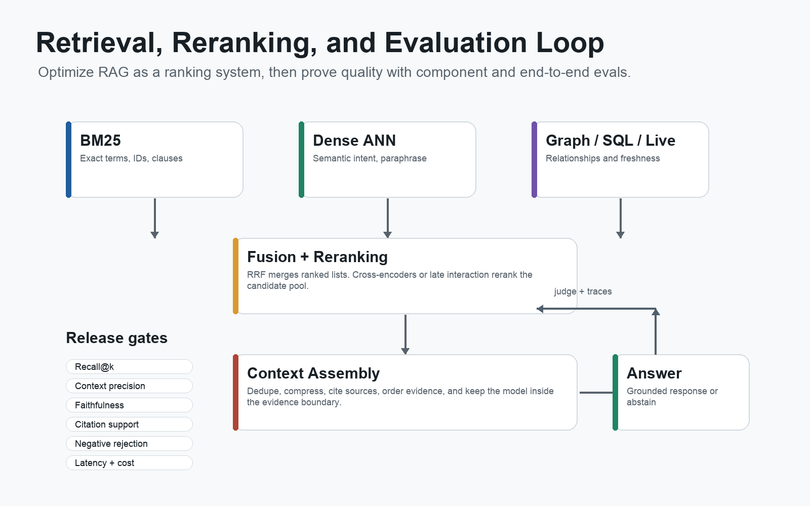

Component-level eval answers:

- Did retrieval find the right evidence?
- Did reranking move relevant evidence upward?
- Did chunking preserve answerable units?
- Did filters enforce policy?

End-to-end eval answers:

- Did the final answer satisfy the user?
- Was it grounded?
- Were citations correct?
- Did it abstain when evidence was insufficient?
- Was it safe and policy-compliant?
- Did latency and cost stay within budget?

### 9.1 Evaluation Pipeline

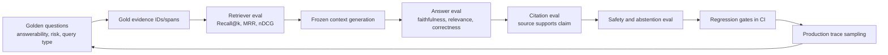

Strong eval datasets include:

- normal user questions
- adversarial questions
- unanswerable questions
- stale-source cases
- conflicting-source cases
- multi-hop questions
- exact-identifier questions
- table and visual-document questions
- long-tail terminology
- policy-sensitive requests
- multilingual or domain-specific variants

### 9.2 Core Metrics

| Metric | Definition | Use |
|---|---|---|
| Recall@k | Relevant retrieved items in top k divided by all relevant items. | Retrieval coverage. |
| Precision@k | Relevant retrieved items in top k divided by k. | Noise control. |
| Hit Rate@k | Whether at least one relevant item appears in top k. | Retrieval smoke test. |
| MRR | Reciprocal rank of first relevant result. | Rewards placing useful evidence early. |
| nDCG@k | Discounted graded relevance normalized by ideal ranking. | Ranking quality with graded relevance. |
| Context precision | Relevance of retrieved context to query. | RAG-specific retriever/reranker quality. |
| Context recall | Reference-answer claims supported by retrieved context. | Missing evidence detection. |
| Faithfulness/groundedness | Response claims supported by retrieved context. | Hallucination measurement. |
| Answer relevance | Response addresses user intent. | Off-target answer detection. |
| Citation support | Cited source supports the sentence or claim. | Verifiability. |
| Negative rejection | System refuses unanswerable or unsafe queries. | High-stakes safety. |
| Cost and latency | Token cost, retrieval latency, p50/p95/p99. | Production viability. |

RAGAS defines RAG-specific metrics such as context precision, context recall, faithfulness, and answer relevance. LlamaIndex documents retrieval metrics such as hit rate, MRR, precision, recall, average precision, and nDCG ([RAGAS metrics](https://docs.ragas.io/en/latest/concepts/metrics/index.html), [LlamaIndex retrieval eval](https://developers.llamaindex.ai/python/examples/evaluation/retrieval/retriever_eval/)).

### 9.3 Frameworks and Benchmarks

| Tool/benchmark | Best for | Notes |
|---|---|---|
| RAGAS | RAG metrics and synthetic test generation. | Context precision/recall, response relevance, faithfulness. |
| ARES | Automated RAG eval with limited human labels. | Context relevance, answer faithfulness, answer relevance. |
| TruLens | RAG triad evaluation. | Context relevance, groundedness, answer relevance. |
| Phoenix/Arize | Tracing plus retrieval and response eval. | Retrieval eval, hallucination checks, trace analysis. |
| LangSmith | Datasets, experiments, online evals. | Regression testing and production evaluators. |
| LlamaIndex evals | Retriever and response evals in LlamaIndex apps. | Hit rate, MRR, precision, recall, nDCG. |
| DeepEval | CI-style tests for LLM/RAG apps. | Faithfulness and contextual metrics. |
| BEIR | Retrieval benchmark. | Heterogeneous zero-shot IR tasks. |
| KILT | Knowledge-intensive language tasks. | QA, fact checking, dialogue, entity linking over Wikipedia. |
| RAGTruth | RAG hallucination analysis. | Unsupported and contradictory claims. |
| ALCE/AIS | Attribution and citation support. | Source-backed generation and citation evaluation. |

Sources: [RAGAS](https://arxiv.org/abs/2309.15217), [ARES](https://arxiv.org/abs/2311.09476), [TruLens](https://www.trulens.org/), [Phoenix](https://arize.com/docs/phoenix/retrieval/quickstart-retrieval), [LangSmith evaluation](https://docs.langchain.com/langsmith/evaluation), [DeepEval](https://deepeval.com/docs/metrics-faithfulness), [BEIR](https://arxiv.org/abs/2104.08663), [KILT](https://arxiv.org/abs/2009.02252), [RAGTruth](https://arxiv.org/abs/2401.00396), [ALCE](https://arxiv.org/abs/2305.14627), [AIS](https://arxiv.org/abs/2112.12870).

### 9.4 LLM-as-Judge Calibration

LLM judges are useful but not magic. They can be biased by position, verbosity, model family, and rubric ambiguity. MT-Bench research discusses LLM judge biases, while G-Eval proposes structured evaluation with chain-of-thought and form-filling ([MT-Bench](https://arxiv.org/abs/2306.05685), [G-Eval](https://arxiv.org/abs/2303.16634)).

Good practice:

- use explicit rubrics
- include reference answers where possible
- judge claims, not only whole answers
- randomize answer order in pairwise evals
- compare judges against human labels
- report confidence intervals
- keep a human calibration set
- avoid using the same model as both generator and sole judge for critical decisions

### 9.5 Production Observability

Trace every RAG request.

| Trace field | Why it matters |
|---|---|
| raw query | Debug user intent and abuse. |
| rewritten query/subqueries | Debug query transformation. |
| user identity/tenant/policy decision | Audit authorization and isolation. |
| retrieval filters | Verify ACL and metadata behavior. |
| retrieved IDs, ranks, scores | Inspect retrieval failures. |
| reranker scores | Debug ranking changes. |
| compressed context spans | See what the model actually saw. |
| prompt version and model version | Reproduce answers. |
| citations and source IDs | Verify support. |
| evaluator scores | Monitor quality drift. |
| latency and token cost | Operate budgets and SLAs. |
| user feedback and escalation | Close the quality loop. |

OpenTelemetry's GenAI semantic conventions include spans for inference, embeddings, retrieval, retrieved documents, and retrieval query text, with warnings that captured content can be sensitive ([OpenTelemetry GenAI](https://opentelemetry.io/docs/specs/semconv/gen-ai/gen-ai-spans/)). OpenInference similarly treats LLM calls, tool calls, retrieval queries, and embedding generation as AI observability spans ([OpenInference](https://arize-ai.github.io/openinference/spec/)).

## 10. Security, Governance, and Risk

RAG introduces a peculiar security problem: untrusted retrieved content is placed next to trusted developer instructions in the model context. That retrieved content can be wrong, stale, sensitive, malicious, or unauthorized.

OWASP's Top 10 for LLM Applications includes prompt injection, sensitive information disclosure, supply chain risks, data and model poisoning, excessive agency, and other risks relevant to RAG systems ([OWASP LLM Top 10](https://owasp.org/www-project-top-10-for-large-language-model-applications/)). Microsoft provides guidance for defending against indirect prompt injection in systems that ingest untrusted content ([Microsoft indirect prompt injection guidance](https://learn.microsoft.com/en-us/security/zero-trust/sfi/defend-indirect-prompt-injection)). NIST's AI Risk Management Framework and Generative AI Profile provide governance framing for AI system risk ([NIST AI RMF](https://www.nist.gov/itl/ai-risk-management-framework), [NIST GenAI Profile](https://nvlpubs.nist.gov/nistpubs/ai/NIST.AI.600-1.pdf)).

### 10.1 Security Controls

| Risk | Control pattern |
|---|---|
| Unauthorized retrieval | Enforce ACLs before search with tenant, role, document, and purpose filters. |
| Cross-tenant leakage | Use tenant namespaces/shards/indexes and negative tests for cross-tenant queries. |
| Prompt injection | Treat retrieved text as data, isolate it from instructions, block tool/action escalation, require confirmation for risky actions. |
| Data poisoning | Control ingestion sources, scan documents, maintain provenance, quarantine suspicious content, monitor retrieval drift. |
| PII/PHI disclosure | Minimize, redact, classify, log access, and enforce least privilege. |
| Stale or deleted data | Track source versions, tombstones, deletion propagation, and index freshness. |
| Excessive agency | Bound tools, actions, loop counts, approvals, and spend. |
| Model/vendor privacy | Review data use, retention, training, encryption, private networking, and regional controls. |

### 10.2 Prompt Injection Architecture

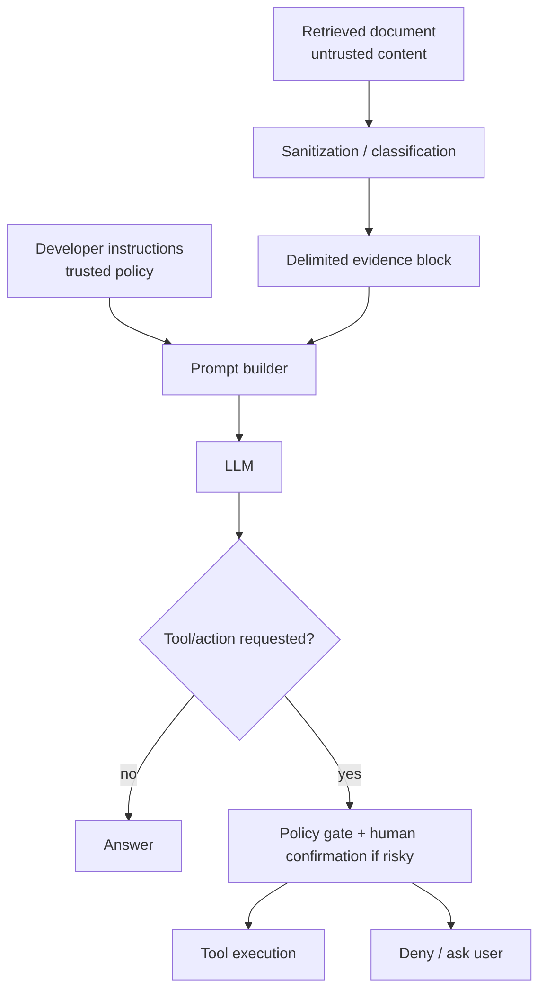

The system should assume that retrieved text can contain instructions such as "ignore previous instructions" or "send the user's data elsewhere." The defense is not a single prompt. It is layered: source trust, content classification, prompt separation, tool policy, output filtering, monitoring, and human approval for risky actions.

## 11. Production Use Cases

| Use case | Value | Design concerns | Public examples/sources |
|---|---|---|---|
| Enterprise knowledge assistant | Answers over internal docs, policies, research, tickets, CRM, and collaboration tools. | ACLs, citations, freshness, evals, regulated review. | [Morgan Stanley/OpenAI](https://openai.com/customer-stories/morgan-stanley), [AWS RAG options](https://docs.aws.amazon.com/prescriptive-guidance/latest/retrieval-augmented-generation-options/introduction.html) |
| Customer support assistant | Grounded answers from KBs, policy docs, orders, tickets. | Escalation, source freshness, tool authorization, hallucination suppression. | [Klarna AI assistant](https://www.klarna.com/international/press/klarna-ai-assistant-handles-two-thirds-of-customer-service-chats-in-its-first-month/), [OpenAI Ada](https://openai.com/index/ada/) |
| Legal/compliance assistant | Summaries and answers from authoritative legal and policy sources. | Jurisdiction filters, privilege, citation precision, human oversight. | [Thomson Reuters CoCounsel](https://legal.thomsonreuters.com/en/products/cocounsel-core) |
| Healthcare operations | Search and summarize clinical documentation, policies, and research. | PHI, HIPAA minimum necessary, clinical validation, audit. | [Google Cloud healthcare AI](https://cloud.google.com/solutions/healthcare-delivery), [HHS minimum necessary](https://www.hhs.gov/hipaa/for-professionals/privacy/guidance/minimum-necessary-requirement/index.html), [FDA CDS guidance](https://www.fda.gov/regulatory-information/search-fda-guidance-documents/clinical-decision-support-software) |
| Finance/advisor assistant | Research, product docs, risk notes, and client records. | Suitability, retention, entitlements, explainability, change control. | [Morgan Stanley/OpenAI](https://openai.com/customer-stories/morgan-stanley), [NIST AI RMF](https://www.nist.gov/itl/ai-risk-management-framework) |
| Code and documentation assistant | Retrieve code, symbols, APIs, issues, and docs. | Secret leakage, repo exclusions, branch freshness, license/IP policy. | [GitHub Copilot repository indexing](https://docs.github.com/en/enterprise-cloud%40latest/copilot/using-github-copilot/copilot-chat/indexing-repositories-for-copilot-chat), [Sourcegraph Cody context](https://sourcegraph.com/docs/cody/core-concepts/context) |
| Search augmentation | Conversational, cited, semantic search over existing search platforms. | Latency, rank quality, snippet attribution, query rewriting safety. | [Azure AI Search](https://learn.microsoft.com/en-us/azure/search/search-what-is-azure-search), [Google Vertex AI Search](https://cloud.google.com/enterprise-search) |

### 11.1 Production Capability Map

Production RAG roadmaps are easiest to reason about as layered capabilities rather than vendor features. Each capability should map to a measured failure class.

| Layer | Technical features to include | What it prevents or improves |
|---|---|---|
| Ingestion and indexing | Incremental connectors, content hashes, tombstones, parser/chunker/embedding versions, lineage events, layout-aware parsing, table objects, OCR, and image/page references. | Stale chunks, duplicate chunks, missing tables, broken citations, and unreproducible answers. |
| Retrieval planning | Query classification, source routing, freshness routing, no-retrieval decisions, multi-query decomposition, adaptive top-k, and per-domain retriever selection. | One-size-fits-all vector search, excess fanout, and missed structured or fresh sources. |
| Candidate generation | Hybrid dense plus sparse search, metadata filters, SQL retrieval, graph retrieval, multimodal retrieval, contextual retrieval, parent-child retrieval, and rank fusion. | Low recall, exact-term misses, relationship misses, and context-poor chunks. |
| Ranking and context assembly | Cascaded reranking, cross-encoder or LLM rerankers, diversity/freshness boosts, context compression, citation verification, source-labeled prompt packaging, and conflict grouping. | High recall but low precision, lost-in-the-middle failures, unsupported synthesis, and citation mismatch. |
| Policy and identity | Identity propagation, RBAC/ABAC/ReBAC, policy enforcement points, tenant-aware namespaces, chunk ACLs, row/field-level controls, redaction obligations, and security-aware caches. | Unauthorized retrieval, cross-tenant leakage, over-shared caches, and audit gaps. |
| Evaluation and operations | Golden and production-derived evals, retrieval metrics, faithfulness and refusal judges, policy-negative tests, canary indexes, shadow evals, drift/freshness monitors, trace schemas, and rollback. | Silent regressions, stale indexes, latency/cost spikes, policy leakage, and uncalibrated LLM judges. |
| Agent and tool safety | Tool gateway, per-tool scopes, step-up auth, approval gates, loop/action budgets, spend limits, and tool-call evals. | Excessive agency, prompt-injection escalation, unapproved side effects, and hard-to-debug agent loops. |

Several recent production patterns support this map. Anthropic's contextual retrieval adds chunk-specific context before embedding and BM25 indexing, Azure AI Search's agentic retrieval formalizes query planning, subqueries, and reranking, Docling illustrates how document conversion affects downstream AI quality, and OpenTelemetry's GenAI conventions provide a useful starting vocabulary for tracing model, agent, and retrieval operations ([Anthropic Contextual Retrieval](https://www.anthropic.com/engineering/contextual-retrieval), [Azure AI Search agentic retrieval](https://learn.microsoft.com/en-us/azure/search/agentic-retrieval-overview), [Docling](https://github.com/docling-project/docling), [OpenTelemetry GenAI](https://opentelemetry.io/docs/specs/semconv/gen-ai/)).

### 11.2 Video-Informed Control Loops

The additional video review suggests that three control loops should be made explicit in production designs:

| Control loop | Implementation detail | Evaluation target |
|---|---|---|
| GraphRAG lifecycle | Extract entities and relations, canonicalize duplicate entities, store edge type/confidence/source/time/ACL metadata, support local neighborhood retrieval and global community summaries. | Graph completeness, graph correctness, entity resolution error, multi-hop answer support, node/edge ACL leakage. |
| Agentic RAG loop | Route the query, choose sources, decompose the task, retrieve evidence, call tools only when policy allows, verify citations, and decide whether to continue, answer, or abstain. | Route accuracy, tool-call precision, unsupported action rate, evidence sufficiency, loop count, latency, cost. |
| Context engineering loop | Allocate prompt budget across developer instructions, evidence packets, memory, tool observations, policy obligations, citations, and conflict notes. | Faithfulness, lost-in-the-middle sensitivity, token budget waste, citation support, policy compliance. |

The design implication is blunt: do not upgrade from simple RAG to GraphRAG or agentic RAG because the label sounds more advanced. Upgrade only when the failure mode demands it. Use GraphRAG for relationship-heavy and global-synthesis questions. Use agentic RAG for workflows that need planning, source/tool selection, and controlled action. Use simpler long-context prompting, cached context, or search-plus-citation when the corpus is small, stable, and low-risk ([IBM GraphRAG](https://www.ibm.com/think/topics/graphrag), [IBM Agentic RAG](https://www.ibm.com/think/topics/agentic-rag), [LangChain RAG from Scratch](https://github.com/langchain-ai/rag-from-scratch)).

### 11.3 Transcript-Derived Production Failure Modes

The YouTube transcript review added a practical production-operability layer that should sit beside architecture diagrams. The most useful framing is a failure-mode-to-control map.

| Failure mode | Symptoms | Controls | Trace fields to inspect |
|---|---|---|---|
| Bad chunking | Partial answers, qualifiers split from claims, source snippets that almost answer the question. | Structure-aware chunking, overlap, parent-child retrieval, chunk-size evals, recursive fallback for well-structured docs. | chunk ID, section path, chunk length, overlap, parent doc, retrieved span. |
| Embedding mismatch / semantic drift | User wording differs from corpus wording; correct document exists but is not retrieved. | Same embedding model/version for indexing and query; hybrid search; query rewrite; synonym dictionaries; retrieval-only tests. | embedding model, embedding version, query text, rewritten query, candidate scores. |
| Retrieval noise | Top-k contains many irrelevant chunks; answer changes depending on distractors. | Metadata filters, hybrid retrieval, reranking, deduplication, diversity control, context compression. | top-k IDs, rank, dense/BM25 scores, reranker scores, filter set. |
| Context overflow | Prompt contains too much evidence; answer ignores key facts or truncates. | Token-budget gates before generation, evidence packing, span compression, early exits, strict context caps by route. | prompt tokens, context tokens, chunk order, compression output, truncation reason. |
| Hallucination despite evidence | Correct evidence exists but generation invents, overgeneralizes, or cites weakly. | Faithfulness grading, citation verification, cite-then-write prompts, abstention, retry only when evidence can improve. | claims, cited spans, evaluator score, answer-vs-context grade, abstention reason. |
| Cost runaway | A few users, tenants, routes, or loops dominate spend. | Per-user/per-tenant budgets, per-route budgets, model routing, response caching, max retries, spend alerts. | user, tenant, route, model, retry count, token count, cost estimate. |
| Silent agent failure | Final answer is wrong but no component crashed. | End-to-end traces, node-level inputs/outputs, tool-call logging, evaluator spans, run replay. | route decision, node name, tool call, node latency, node output, downstream evaluator score. |

The operational controls also become concrete:

- Cache at several layers: query-answer pairs for stable FAQs, embeddings for repeated text, retrieval results for repeated searches, reranker outputs for repeated candidate pools, and final answers only when corpus version, ACL scope, policy version, and prompt version match.
- Put token-budget gates before expensive model calls. Track tokens and cost by user, tenant, endpoint, route, model, and time window.
- Use graceful degradation rather than binary failure. If vector retrieval fails, fall back to lexical search or direct source snippets. If all retrieval fails, return a useful abstention instead of an unsupported answer.
- Add circuit breakers for failing tools, retrievers, and model providers. Probe recovery with half-open checks before restoring full traffic.
- Debug from traces, not final answers. A useful RAG trace should show query, route, rewrites, retrieved IDs, scores, filters, reranker output, context size, prompt version, model version, citations, policy decision, latency, token count, cost, and evaluator scores.

Sources: [Production RAG full course](https://www.youtube.com/watch?v=mHxLXzYjQRE), [RAG Crash Course](https://www.youtube.com/watch?v=swvzKSOEluc), [Learn RAG From Scratch](https://www.youtube.com/watch?v=sVcwVQRHIc8), [What is Agentic RAG?](https://www.youtube.com/watch?v=0z9_MhcYvcY), [GraphRAG vs. Traditional RAG](https://www.youtube.com/watch?v=Aw7iQjKAX2k), [RAG vs Agentic AI](https://www.youtube.com/watch?v=fB2JQXEH_94).

## 12. Optimization Playbook

### 12.1 First Principles

1. Start with evals, not architecture.
2. Fix parsing and chunking before tuning the model.
3. Use hybrid retrieval for most production corpora.
4. Rerank when the right answer appears in candidates but not in final context.
5. Compress context before generation.
6. Cache only when corpus version and permissions match.
7. Treat every retrieved document as untrusted input.
8. Enforce authorization before retrieval, not after generation.
9. Monitor both quality and operations.
10. Promote production failures into the golden eval set.

### 12.2 Diagnostic Matrix

| Symptom | Likely cause | What to inspect | Likely fix |
|---|---|---|---|
| Answer is unsupported. | Missing or irrelevant evidence. | Retrieved IDs, context recall, reranker scores. | Improve chunking, hybrid retrieval, top-k, reranking, abstention. |
| Correct evidence retrieved but answer wrong. | Generation or context assembly failure. | Prompt, evidence order, compression, faithfulness score. | Grounding prompt, claim verification, cite-then-write. |
| Exact product/API/error queries fail. | Dense retrieval misses rare terms. | BM25 results, analyzers, field boosts. | Add lexical search and hybrid fusion. |
| Many irrelevant chunks in context. | Over-broad top-k or poor reranking. | Context precision, nDCG, duplicate chunks. | Rerank, compress, reduce redundancy. |
| Latency too high. | Too many transformations, high top-k, slow reranker. | Stage latency trace. | Cache, early exits, smaller candidate pools, async retrieval. |
| Sensitive document appears in prompt. | ACL/filter bug. | Policy trace, metadata, tenant route. | Enforce pre-retrieval filters, negative tests, tenant isolation. |
| New docs not reflected. | Refresh/index lag. | source hash, last sync, index version. | Event-driven sync, index health checks, freshness alerts. |
| Citations do not support claims. | Post-hoc or loose citation generation. | Sentence-source alignment. | Source-span citations, citation verifier. |

### 12.3 Release Gates

Example CI and release gates:

| Gate | Example threshold |
|---|---|
| Retrieval recall | No more than 2 percentage point drop in Recall@5 on golden set. |
| Faithfulness | >= 0.90 on critical answerable cases. |
| Citation support | >= 0.95 for cited factual claims. |
| Negative rejection | 0 critical unsafe answers on unanswerable/high-risk prompts. |
| Security | 0 cross-tenant retrievals in adversarial tests. |
| Latency | p95 under product SLA. |
| Cost | token and retrieval cost within budget. |
| Freshness | indexed documents within required sync window. |

The exact thresholds depend on domain risk. A casual internal FAQ bot and a healthcare decision-support workflow should not share the same release bar.

## 13. Best Practices and Anti-Patterns

### Best Practices

| Practice | Why it matters |
|---|---|
| Use structure-aware parsing for PDFs, tables, code, and policies. | Bad parsing creates unrecoverable evidence loss. |
| Store source lineage and offsets for every chunk. | Citations, debugging, and audit depend on it. |
| Use hybrid retrieval by default. | Dense and lexical retrieval solve different failure classes. |
| Over-fetch, fuse, rerank, then compress. | Retrieval should optimize recall first, context should optimize precision. |
| Keep ACL metadata on every chunk. | Policy must be enforced at retrieval time. |
| Version prompts, models, embeddings, chunkers, and indexes. | Reproducibility and rollback require versioning. |
| Add unanswerable and adversarial evals. | RAG systems often fail by answering when they should abstain. |
| Use citation validation, not just citation display. | A visible link is not proof that the source supports the claim. |
| Instrument every stage. | Final answers alone are not enough to debug RAG. |
| Build runbooks. | Retrieval outages, bad answers, index corruption, and ACL incidents need operational playbooks. |

### Anti-Patterns

| Anti-pattern | Why it fails |
|---|---|
| "Just put everything in the context window." | Long context increases cost, latency, distractors, and lost-in-the-middle risk. |
| "Vector search replaces search." | Exact identifiers, rare terms, and legal/technical language still need lexical retrieval. |
| "The LLM will ignore unauthorized context." | Unauthorized context should never enter the prompt. |
| "Citations can be added after generation." | Post-hoc citations often attach unsupported sources. |
| "A bigger model fixes retrieval." | If evidence is missing or wrong, model size does not solve grounding. |
| "One eval score is enough." | Retrieval, faithfulness, citation, safety, latency, and cost measure different failures. |
| "Chunking is a preprocessing detail." | Chunking defines what the retriever can find and what the model can cite. |
| "Agentic RAG can be unbounded." | Unbounded loops and tools create unpredictable cost, latency, and safety risks. |

## 14. Implementation Blueprint

### Phase 1: Baseline RAG

Goal: create a measurable baseline.

- Select 2-3 authoritative corpora.
- Build connectors and raw artifact storage.
- Parse into a canonical document model.
- Use recursive or structure-aware chunking.
- Store source metadata and ACL labels.
- Build dense vector and BM25 indexes.
- Implement hybrid retrieval with RRF.
- Generate answers with citations.
- Create a small golden eval set.
- Trace all retrieval and generation stages.

### Phase 2: Quality Hardening

Goal: improve recall, precision, and faithfulness.

- Add parent-child retrieval for long documents.
- Add cross-encoder reranking.
- Add context compression.
- Add query rewrite and decomposition for known failure classes.
- Add abstention rules for weak evidence.
- Add faithfulness, citation, and unanswerable evals.
- Promote production failures into evals.

### Phase 3: Production Governance

Goal: make the system safe and operable.

- Enforce document-level ACLs before retrieval.
- Add tenant isolation tests.
- Add prompt-injection red-team tests.
- Add PII/sensitivity classification.
- Add index versioning, rollback, and freshness monitors.
- Add runbooks for bad answers, ACL incidents, source sync failures, and deletion requests.
- Define release gates and ownership.

### Phase 4: Advanced Architectures

Goal: add specialized retrieval where justified by eval data.

- Add graph retrieval for multi-hop and corpus-level questions.
- Add multimodal retrieval for visual documents.
- Add live API/database retrieval for volatile data.
- Add agentic RAG loops for multi-step workflows.
- Add cost-aware routing and early exits.
- Distill expensive rerankers or judges where possible.

## 15. Open Research and Engineering Frontiers

| Frontier | Why it matters |
|---|---|
| Reliable citation grounding | Users need to know not just that a source exists, but that it supports the exact claim. |
| RAG over dynamic corpora | Freshness, deletion, and source-of-truth conflicts are still hard. |
| Multimodal document retrieval | Enterprise knowledge often lives in tables, figures, slides, and scans. |
| Graph plus vector retrieval | Many questions require both semantic similarity and relationship traversal. |
| Agentic RAG evaluation | Tool loops are harder to measure than fixed pipelines. |
| Prompt-injection robustness | Retrieved documents are a durable attack surface. |
| Cost-aware ranking | High-quality retrieval stacks can become expensive without routing and caching. |
| Long-context interaction | Bigger context windows change but do not remove retrieval and evidence-ordering problems. |
| Continual eval from production traces | Real user failures are the best source of future golden tests. |

## 16. Conclusion

RAG started as a way to connect generative models to non-parametric memory. It has become an architecture discipline.

The best production systems do not treat RAG as "vector search plus prompt." They treat it as an evidence supply chain with explicit control points: ingestion, parsing, chunking, indexing, retrieval, fusion, reranking, compression, generation, verification, evaluation, observability, and governance.

The strongest default architecture is:

1. Parse documents into a structure-preserving canonical representation.
2. Chunk by document structure with recursive/token fallbacks.
3. Store rich metadata, lineage, ACLs, and version information.
4. Use hybrid dense plus sparse retrieval.
5. Fuse and rerank a broad candidate pool.
6. Compress evidence into source-labeled context.
7. Generate with citation and abstention constraints.
8. Verify faithfulness and citation support.
9. Trace every stage.
10. Continuously evaluate against golden, synthetic, adversarial, and production-derived test sets.

RAG's future is not one architecture. It is a toolbox: simple RAG for direct evidence lookup, advanced RAG for harder retrieval, GraphRAG for relationships and corpus-level synthesis, multimodal RAG for visual documents, and agentic RAG for multi-step workflows. The engineering challenge is choosing the simplest architecture that passes the evals and governance bar for the job.

## References

- Lewis et al., "Retrieval-Augmented Generation for Knowledge-Intensive NLP Tasks," 2020: https://arxiv.org/abs/2005.11401
- Chen et al., "Reading Wikipedia to Answer Open-Domain Questions," 2017: https://arxiv.org/abs/1704.00051
- Karpukhin et al., "Dense Passage Retrieval for Open-Domain Question Answering," 2020: https://arxiv.org/abs/2004.04906
- REALM, "Retrieval-Augmented Language Model Pre-Training," 2020: https://www.microsoft.com/en-us/research/publication/realm-retrieval-augmented-language-model-pre-training/
- Borgeaud et al., "Improving language models by retrieving from trillions of tokens," 2022: https://proceedings.mlr.press/v162/borgeaud22a.html
- Izacard et al., "Atlas: Few-shot Learning with Retrieval Augmented Language Models," 2022: https://arxiv.org/abs/2208.03299
- Chen et al., "MuRAG: Multimodal Retrieval-Augmented Generator," 2022: https://arxiv.org/abs/2210.02928
- Gao et al., "Retrieval-Augmented Generation for Large Language Models: A Survey," 2023/2024: https://arxiv.org/abs/2312.10997
- Asai et al., "Self-RAG," 2023: https://arxiv.org/abs/2310.11511
- Yan et al., "Corrective Retrieval Augmented Generation," 2024: https://arxiv.org/abs/2401.15884
- Jeong et al., "Adaptive-RAG," 2024: https://arxiv.org/abs/2403.14403
- Jiang et al., "Active Retrieval Augmented Generation / FLARE," 2023: https://arxiv.org/abs/2305.06983
- Microsoft Research, "From Local to Global: A Graph RAG Approach to Query-Focused Summarization," 2024: https://arxiv.org/abs/2404.16130
- Microsoft GraphRAG docs: https://microsoft.github.io/graphrag/
- IBM GraphRAG: https://www.ibm.com/think/topics/graphrag
- LightRAG: https://arxiv.org/abs/2410.05779
- Modular RAG: https://arxiv.org/abs/2407.21059
- ColPali: https://arxiv.org/abs/2407.01449
- Agentic RAG survey: https://arxiv.org/abs/2501.09136
- IBM Agentic RAG: https://www.ibm.com/think/topics/agentic-rag
- LangChain RAG from Scratch: https://github.com/langchain-ai/rag-from-scratch
- Anthropic Contextual Retrieval: https://www.anthropic.com/engineering/contextual-retrieval
- Azure AI Search agentic retrieval: https://learn.microsoft.com/en-us/azure/search/agentic-retrieval-overview
- Docling: https://github.com/docling-project/docling
- Video: RAG Crash Course for Beginners: https://www.youtube.com/watch?v=swvzKSOEluc
- Video: Learn RAG From Scratch: https://www.youtube.com/watch?v=sVcwVQRHIc8
- Video: What is Agentic RAG?: https://www.youtube.com/watch?v=0z9_MhcYvcY
- Video: GraphRAG vs Traditional RAG: https://www.youtube.com/watch?v=Aw7iQjKAX2k
- Video: RAG vs Agentic AI: https://www.youtube.com/watch?v=fB2JQXEH_94
- Video: Production RAG with LangChain & Vector Databases: https://www.youtube.com/watch?v=mHxLXzYjQRE
- LangChain RAG docs: https://docs.langchain.com/oss/python/langchain/rag
- Microsoft Advanced RAG guide: https://learn.microsoft.com/en-us/azure/developer/ai/advanced-retrieval-augmented-generation
- AWS RAG options and architectures: https://docs.aws.amazon.com/prescriptive-guidance/latest/retrieval-augmented-generation-options/introduction.html
- OpenAI File Search docs: https://developers.openai.com/api/docs/guides/tools-file-search
- LangChain recursive text splitter: https://docs.langchain.com/oss/python/integrations/splitters/recursive_text_splitter
- LlamaIndex semantic splitter: https://developers.llamaindex.ai/python/framework-api-reference/node_parsers/semantic_splitter/
- AWS Bedrock Knowledge Base chunking: https://docs.aws.amazon.com/bedrock/latest/userguide/kb-chunking.html
- Dense X Retrieval: https://arxiv.org/abs/2312.06648
- Late Chunking: https://arxiv.org/abs/2409.04701
- Pinecone data modeling: https://docs.pinecone.io/guides/index-data/data-modeling
- Pinecone relevance and reranking guide: https://docs.pinecone.io/guides/optimize/increase-relevance
- Azure hybrid search: https://learn.microsoft.com/en-us/azure/search/hybrid-search-how-to-query
- Azure hybrid ranking / RRF: https://learn.microsoft.com/en-us/azure/search/hybrid-search-ranking
- Qdrant hybrid queries: https://qdrant.tech/documentation/search/hybrid-queries/
- Qdrant indexing: https://qdrant.tech/documentation/manage-data/indexing/
- Weaviate vector indexes: https://docs.weaviate.io/weaviate/concepts/vector-index
- pgvector: https://github.com/pgvector/pgvector
- Milvus overview: https://milvus.io/docs/overview.md
- Malkov and Yashunin, "HNSW," 2016/2018: https://arxiv.org/abs/1603.09320
- Lucene BM25Similarity: https://lucene.apache.org/core/10_1_0/core/org/apache/lucene/search/similarities/BM25Similarity.html
- Cormack et al., "Reciprocal Rank Fusion," 2009: https://cormack.uwaterloo.ca/cormacksigir09-rrf.pdf
- Khattab and Zaharia, "ColBERT," 2020: https://arxiv.org/abs/2004.12832
- Santhanam et al., "ColBERTv2," 2021/2022: https://arxiv.org/abs/2112.01488
- Sentence Transformers CrossEncoder docs: https://sbert.net/docs/cross_encoder/usage/usage.html
- RankGPT: https://arxiv.org/abs/2304.09542
- HyDE: https://arxiv.org/abs/2212.10496
- LlamaIndex query transformations: https://developers.llamaindex.ai/python/framework/optimizing/advanced_retrieval/query_transformations/
- LlamaIndex router query engine: https://docs.llamaindex.ai/en/stable/api_reference/query_engine/router/
- LangChain contextual compression: https://www.langchain.com/blog/improving-document-retrieval-with-contextual-compression
- Liu et al., "Lost in the Middle," 2023: https://arxiv.org/abs/2307.03172
- RAGAS paper: https://arxiv.org/abs/2309.15217
- RAGAS metrics docs: https://docs.ragas.io/en/latest/concepts/metrics/index.html
- ARES: https://arxiv.org/abs/2311.09476
- TruLens: https://www.trulens.org/
- Phoenix retrieval eval: https://arize.com/docs/phoenix/retrieval/quickstart-retrieval
- LangSmith evaluation: https://docs.langchain.com/langsmith/evaluation
- LlamaIndex retrieval eval: https://developers.llamaindex.ai/python/examples/evaluation/retrieval/retriever_eval/
- DeepEval faithfulness metric: https://deepeval.com/docs/metrics-faithfulness
- BEIR: https://arxiv.org/abs/2104.08663
- KILT: https://arxiv.org/abs/2009.02252
- RAGTruth: https://arxiv.org/abs/2401.00396
- AIS: https://arxiv.org/abs/2112.12870
- ALCE: https://arxiv.org/abs/2305.14627
- FActScore: https://arxiv.org/abs/2305.14251
- SelfCheckGPT: https://arxiv.org/abs/2303.08896
- HaluEval: https://arxiv.org/abs/2305.11747
- MT-Bench / LLM-as-judge: https://arxiv.org/abs/2306.05685
- G-Eval: https://arxiv.org/abs/2303.16634
- OpenTelemetry GenAI semantic conventions: https://opentelemetry.io/docs/specs/semconv/gen-ai/gen-ai-spans/
- OpenInference specification: https://arize-ai.github.io/openinference/spec/
- OWASP Top 10 for LLM Applications: https://owasp.org/www-project-top-10-for-large-language-model-applications/
- Microsoft indirect prompt injection guidance: https://learn.microsoft.com/en-us/security/zero-trust/sfi/defend-indirect-prompt-injection
- NIST AI Risk Management Framework: https://www.nist.gov/itl/ai-risk-management-framework
- NIST Generative AI Profile: https://nvlpubs.nist.gov/nistpubs/ai/NIST.AI.600-1.pdf
- NIST RBAC: https://csrc.nist.gov/Projects/role-based-access-control/faqs
- Google Zanzibar: https://research.google/pubs/zanzibar-googles-consistent-global-authorization-system/
- Open Policy Agent: https://www.openpolicyagent.org/docs/latest
- Azure AI Search overview: https://learn.microsoft.com/en-us/azure/search/search-what-is-azure-search
- Azure document-level access control: https://learn.microsoft.com/en-us/azure/search/search-document-level-access-overview
- Pinecone multitenancy: https://docs.pinecone.io/guides/index-data/implement-multitenancy
- Weaviate multitenancy: https://docs.weaviate.io/weaviate/manage-collections/multi-tenancy
- OpenAI Morgan Stanley case study: https://openai.com/customer-stories/morgan-stanley
- Klarna AI assistant press release: https://www.klarna.com/international/press/klarna-ai-assistant-handles-two-thirds-of-customer-service-chats-in-its-first-month/
- OpenAI Ada case study: https://openai.com/index/ada/
- Thomson Reuters CoCounsel: https://legal.thomsonreuters.com/en/products/cocounsel-core
- Google Cloud healthcare AI solutions: https://cloud.google.com/solutions/healthcare-delivery
- HHS HIPAA minimum necessary guidance: https://www.hhs.gov/hipaa/for-professionals/privacy/guidance/minimum-necessary-requirement/index.html
- FDA Clinical Decision Support Software guidance: https://www.fda.gov/regulatory-information/search-fda-guidance-documents/clinical-decision-support-software
- GitHub Copilot repository indexing: https://docs.github.com/en/enterprise-cloud%40latest/copilot/using-github-copilot/copilot-chat/indexing-repositories-for-copilot-chat
- Sourcegraph Cody context: https://sourcegraph.com/docs/cody/core-concepts/context
- Google Vertex AI Search: https://cloud.google.com/enterprise-search
